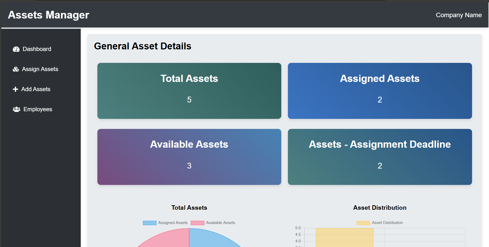
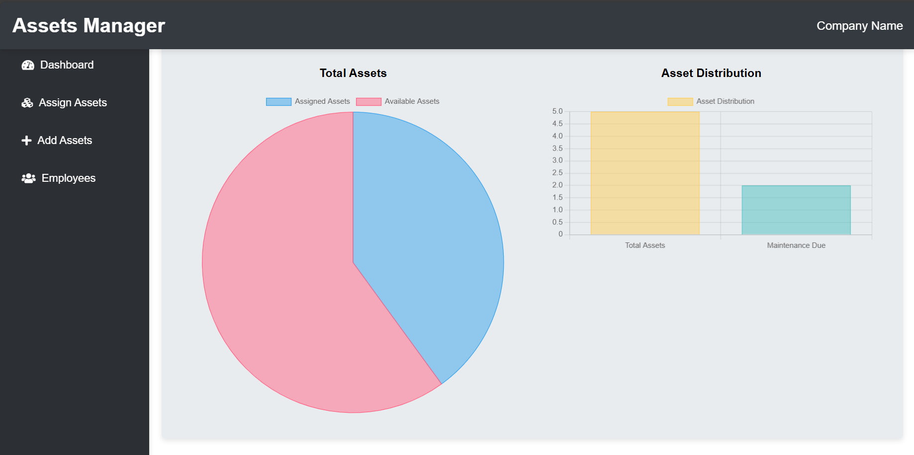

## Features

- **Asset Management:** Add, edit, and delete assets with detailed information including type, brand, and model.
- **Employee Management:** Manage employee details to assign assets efficiently.
- **Assignment Tracking:** Assign assets to employees with assignment and deadline dates.
- **Condition Monitoring:** Track the condition of assets (New, Good, Damaged) over time.
- **User-Friendly Interface:** A responsive and intuitive UI built with Bootstrap for easy navigation and usage.
- **Notifications:** Real-time notifications using Toastr for success and error messages.
- **Validation:** Comprehensive form validation to ensure data integrity.

## Tech Stack

- **Backend:** PHP, Laravel
- **Frontend:** HTML, CSS, Bootstrap
- **Database:** MySQL
- **Server:** XAMPP

## Prerequisites

- XAMPP
- Composer
- Git

## Installation

1. **Clone the repository:**
   ```bash
   git clone https://github.com/Sanjaybabu1112/Advanced-Asset-Management-System-using-PHP-Laravel-XAMPP-and-MySQL.git
   cd project_directory
   ```

2. **Set up XAMPP:**
   - Start Apache and MySQL from the XAMPP control panel.

3. **Create a MySQL database:**
   - Open phpMyAdmin (http://localhost/phpmyadmin) and create a new database.

4. **Configure environment variables:**
   - Copy the `.env.example` file to `.env`:
     ```bash
     cp .env.example .env
     ```
   - Update the `.env` file with your database credentials:
     ```plaintext
     DB_DATABASE=your_database_name
     DB_USERNAME=your_database_username
     DB_PASSWORD=your_database_password
     ```

5. **Install dependencies:**
   ```bash
   composer install
   ```

6. **Run migrations:**
   ```bash
   php artisan migrate
   ```

7. **Start the Laravel development server:**
   ```bash
   php artisan serve
   ```

8. **Access the application:**
   - Open your browser and navigate to `http://localhost:8000`.

## Usage

- **Add Assets:** Navigate to the assets section to add, edit, or delete assets.
- **Manage Employees:** Use the employee section to manage employee details.
- **Assign Assets:** Assign assets to employees with specific dates and track their condition.
- **Monitor Conditions:** Keep track of asset conditions and update them as necessary.

## Screenshots





## Contributing

Contributions are welcome! Please follow these steps to contribute:

1. Fork the repository.
2. Create a new branch (`git checkout -b feature/your-feature`).
3. Make your changes.
4. Commit your changes (`git commit -m 'Add some feature'`).
5. Push to the branch (`git push origin feature/your-feature`).
6. Open a pull request.
